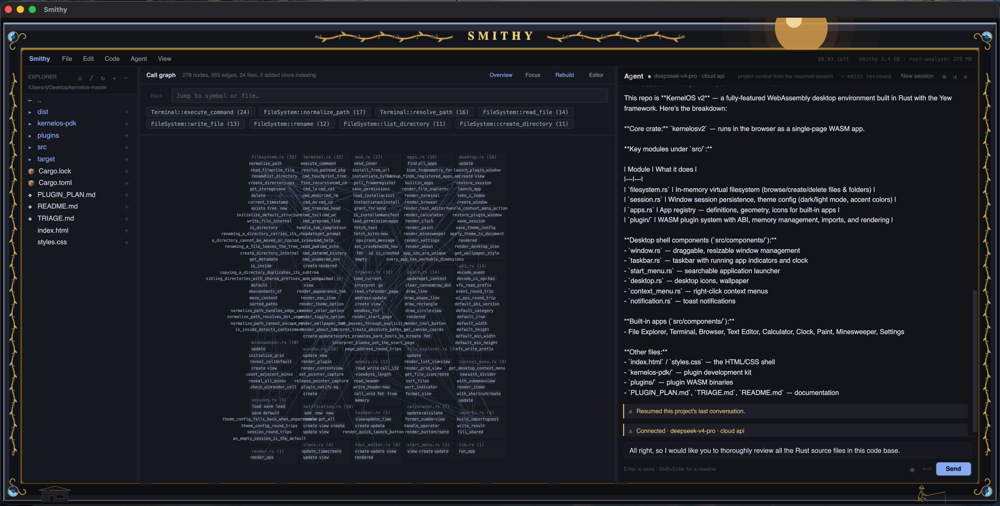

# Smithy for Windows

**A native Rust IDE and coding agent that runs on your own machine — with a
second model watching the first, and Runs that work while you sleep.**

Open a project, edit files, and ask an agent to do the work, against a model you
host yourself: LM Studio, vLLM, or anything else that speaks the OpenAI API. The
model needs no account and no network. This is a fork of
[Smithy](https://github.com/Divhanthelion/Smithy-v1) that runs on **Windows** as
well as macOS, and adds — above all — two things the original does not have:

- **[Jev](#jev-a-second-model-that-checks-the-first)**, TypeSafe's fast
  decision model, wired into the agent loop as its reflexes. The agent writes
  the code; Jev answers the questions a careful developer asks while watching —
  *is this command dangerous? is it going in circles? is it actually done?
  would building this hurt someone? did it just loosen a test to make it
  pass?* — in a fraction of a second, as a probability rather than an opinion.
- **[Unattended Runs](#unattended-runs)**: one sentence in, a branch of
  checked commits out. `smithy-agent run "…"` plans the work, researches what it
  needs with sources you can check, builds it task by task, and commits only
  what the compiler and the tests accept. Jev makes the judgment calls along
  the way. You read the report in the morning.



The agent can read your code, search it, run commands and write files. Every
write comes back as a diff you approve hunk by hunk, and every shell command
waits for your go-ahead unless you turn YOLO on.

---

## What this fork adds

| | |
|---|---|
| **Jev** | A second model at every step of every Session: a risky-command check under YOLO, loop detection, and a "really done?" check; in Runs, the intent guardrail, the test-weakening check and the next move. [How it works →](#jev-a-second-model-that-checks-the-first) |
| **Unattended Runs** | `smithy-agent run` turns an intent into planned, researched, checked commits on their own branch, and writes a morning report. Resumable, detachable, never pushes. [How it works →](#unattended-runs) · [Set up a Jetson AGX Thor →](thor/THOR.md) |
| **Research you can check** | Every page the agent reads is saved by hash; `cite_check` confirms each quoted finding is really on the page it cites; Notes are kept in a library shared between Projects. |
| **Windows** | The agent's shell is Git for Windows' bash, with a Job Object so a timeout kills the whole process tree. Windows paths, `USERPROFILE`, keys in Credential Manager, toast notifications, and a window that fits the screen at any scaling. |
| **Measured, in the open** | [A field report](reports/2026-09-24-unattended-runs-on-the-thor.md) on five real Runs with a local model on a Jetson AGX Thor: the first finished one task of six in three and a half hours; the fourth finished everything in 53 minutes; the fifth, on a real project, wrote code that matched an outside reference (Hebcal) on all 13,991 days of Daf Yomi and 351 molad announcements checked. |

---

## Why this and not the editor you already have

Most agent IDEs ask you to trust the agent. Smithy is built so you don't have
to. Every distinctive thing in it exists to let you *check* something you would
otherwise have to take on faith.

**A second model checks the first.** A coding model is a poor judge of its own
work: it loops without noticing, calls a half-finished job done, and will edit a
failing test until it passes. Smithy asks [Jev](#jev-a-second-model-that-checks-the-first),
a separate model built to return calibrated decisions, at the moments those
mistakes happen. Jev can add caution — a prompt, a nudge, a stop — but it never
approves anything on its own, and without it Smithy behaves exactly as it did
before Jev existed.

**Done means the tests say so.** In a Run, a task is finished when the runner
has run its checks itself, nothing that passed before has broken, and no test
that existed before was weakened, skipped or deleted to get there. The model's
word counts for nothing, and neither does Jev's.

**You can see what it is about to do.** Every `edit` and `write` opens as a diff
and the agent's tool call *waits* for your decision, then hears the real outcome
— "accepted in full", "3 of 5 hunks", "rejected" — as that call's own result.
That sounds like a detail and is not. Before it worked this way, a measured
session made 25 edits in one turn and spent **26 of its 76 tool calls** trying
to discover whether they had landed. They all had.

**You can see what it cost.** The agent panel breaks the prompt into system
prompt, project map, tool schemas and conversation, marks which of those are
frozen for the session and which are still growing, and shows how much came
from the provider's cache rather than being paid for again. On a recent session
that was 76–79%. Most tools show you a spend figure; this one shows you where
it went.

**The sandbox is a capability, not a path check.** Filesystem tools hold a
`cap-std` directory handle for your project root, so the operating system itself
refuses to let those reads and writes out — symlinks included. A second handle
covers session scratch under the OS temp directory. There is no string
comparison to outwit. Shell is different: `bash` is a subprocess, not a
capability, and it does not run until a shell-approval hook is installed. With
YOLO on, in-Project writes skip Review and commands that stay in the Project
skip the prompt, while `cd ..` and paths outside the Project still ask.
Environment variables named `*_API_KEY`, `*_TOKEN` and `*_SECRET` are removed
from the shell's environment.

**The call graph is resolved by the compiler.** Edges come from rust-analyzer
via SCIP, not from matching names. Name matching was tried first and measured:
it was right 55% of the time on this workspace, and it failed hardest on
`new`, `default` and `run` — the most-called names in any codebase. A map that
is confidently wrong about half your call sites is worse than no map.

**The model is yours.** Point it at LM Studio or a vLLM server and nothing
leaves your machine; it keeps working with the network off. Point it at
DeepSeek or OpenRouter if you would rather. Either way the editor is not a
subscription and the code is not someone else's training data.

**It leaves room for the model.** Smithy idles around **200 MB**. Measured on
the same Mac at the same moment, Cursor's processes totalled **3.0 GB** and
Claude's desktop app **2.2 GB**. On machines where the memory is *unified* —
Apple Silicon, or a Jetson — the editor, the operating system and your local
model all draw from one pool, and whatever your editor holds is weights you
cannot load. On a 16 GB machine, a three-gigabyte editor is the difference
between running a 13B model and not running one.

**Dictation is built in, and local.** Press a key and talk; the words appear as
you say them, and a pause ends it. NVIDIA's Nemotron streaming recognizer runs
in-process through sherpa-onnx and the audio never leaves the machine. No
separate app, no API call, no upload.

**Honestly, what it is not:** the editor runs on Windows and macOS; on Linux
it is untested. (The command-line agent, `smithy-agent`, runs Runs daily on a
Jetson AGX Thor's Linux: see [thor/THOR.md](thor/THOR.md).) The deep features —
symbol index, call graph — are Rust; other languages get syntax highlighting,
LSP and the agent, but not the map. Jev needs either a hosted service with paid
credits or [JevK5](#turning-it-on) on your own GPU; everything else works
offline. Dictation is English only, on the CPU, about 750 MB while
loaded, and **not yet tried with a real microphone** in the editor (see
[Dictation](#dictation)). It is young, and the [known gaps](#known-gaps) list is the
real one, not a polite one. If you want the most mature agent IDE, it is not
this. If you want one whose claims you can verify, that is the whole idea.

---

## Jev: a second model that checks the first

### What Jev is

Jev (`typesafe-ai/jev`) is TypeSafe's "System One" model: it does not write
text. You give it a short description of a situation
and a precise question, and it gives back a probability — or, for a choice,
the pick and how sure it is. It answers in a fraction of a second, which is
fast enough to sit inside every step of an agent loop without slowing it down.
Smithy reaches it through the Vercel AI Gateway.

The coding model and Jev do different jobs. The coding model (yours, local or
hosted) decides *what to do*; Jev answers *whether what just happened is
right* — the reflex a person supervising an agent would bring, asked of a model
whose only job is to answer that kind of question well.

### Where Smithy asks it

In every agent Session, in the editor and the terminal:

| Moment | Question | What a yes does |
|---|---|---|
| YOLO is about to run a shell command without asking | Would a careful developer want to confirm this first? (deleting in bulk, `reset --hard`, `push --force`, sending secrets over the network, installing software…) | The silent run becomes an approval prompt |
| After each step, from the fourth | Is the agent stuck — repeating actions, re-reading what it has, retrying a failing approach unchanged? | A nudge to change approach; a second yes ends the turn |
| Before a turn ends with an answer | Has the agent finished what was asked, or stopped partway? | The answer is sent back once to finish the job |

In [unattended Runs](#unattended-runs), where nobody is there to catch mistakes:

| Decision | Question | What it does |
|---|---|---|
| Guardrail | Would building this intent — then each Task — be illegal or clearly harmful to others? | Stops the Run and wakes you; no answer at all also stops it |
| Cheat check | Were existing tests changed to make them pass, rather than because the Task needed it? | Reverts the Attempt and blocks the Task |
| Next move | After a failed round: keep going, research, hand off to a fresh Session, escalate to you, or block the Task? | Picks the next step; below 30% confidence the runner's default applies |
| Research | Does this Task hinge on outside facts a model is unlikely to know? Does a research Note actually answer its question? | Reported in the morning report; decides whether an old Note is reused |

Each question is written out once, with concrete examples of yes and no, in [`crates/smithy-agent/src/jev.rs`](crates/smithy-agent/src/jev.rs).

### How it is kept honest

- **It can only add caution.** For the shell check, Jev never approves
  anything: the command it judges was written by a model that reads your
  repository, so an answer that could *skip* a prompt would make the prompt
  negotiable. The worst a wrong answer costs is one extra click.
- **The checks outrank it.** In a Run the order of authority is: the compiler
  and the tests, then mechanical rules, then Jev, then the model. A Task is
  done when its checks pass, never because Jev (or the model) says so.
- **The thresholds are measured, not guessed.**
  `cargo run -p smithy-agent --example jev <suite>` scores labelled cases for
  every question and reports the misses. On the 63-case suite, 62 land on the
  correct side and the 63rd was a rate-limit error, not a wrong answer. The
  measured ranges sit beside each threshold in the code; the guardrail's
  must-stop side is not yet calibrated, and the
  [field report](reports/2026-09-24-unattended-runs-on-the-thor.md) says so.
- **Every decision is logged with what Jev was shown.** A Run's
  `decisions.jsonl` records the exact state, the answer, the threshold and the
  action, and the morning report counts which decisions were later shown right
  or wrong, so thresholds can be re-checked against real Runs.
- **Absent means off, not broken.** No key, no network or a slow gateway (5
  seconds) and each check falls back to what Smithy did before Jev — except
  the Run guardrail, which fails closed: a Run with no Jev builds nothing.

### What it sends

Besides web search and whichever hosted model you choose (if any), Jev is the
only service Smithy sends anything to. It gets the question and a short state,
each piece cut to length: a shell command
with the project's path; the request (up to 1,500 characters), the last few
tool calls with their arguments and a line or two of each result (about 200
characters apiece), and the final answer (up to 2,000); in a Run, the intent,
a Task's title and checks, check-result excerpts, the diff of pre-existing
tests a Task changed, and research Notes. Never the whole conversation or a
whole source file; the longest pieces are those test diffs (up to 6,000
characters) and Notes (up to 7,000).

### Turning it on

In **Agent → Backend Settings…**, under *Jev*, choose where its questions go
and paste that service's key:

| Service | Address | Key |
|---|---|---|
| **TypeSafe** (default) | `https://api.typesafe.ai/v1/systemone`, model `jev-latest` | a TypeSafe key from console.typesafe.ai (`TYPESAFE_API_KEY`) |
| **Vercel AI Gateway** | `https://ai-gateway.vercel.sh/typesafe/v1/systemone`, model `typesafe-ai/jev` | a gateway key with paid credits; free-tier accounts are refused (`AI_GATEWAY_API_KEY`) |
| **Custom server** | any server with the same API, e.g. JevK5 on your own GPU | optional (`JEV_API_KEY`) |

Keys go into the OS credential store. That's all; the checks switch on for every
Session. A settings file from before this choice existed uses whichever of the
first two has a key. `JEV_ENDPOINT`, `JEV_MODEL` and `JEV_API_KEY` in the
environment override all of it. Two open models have been tried as a custom
server on the 63-case suite:

| Server | Wrong side | Notes |
|---|---|---|
| Jev, hosted | 1 | a 429, not a wrong answer |
| [JevK5](https://huggingface.co/alibiserikbay/JevK5) v0.3, local | 7 | right on every destructive command, weakened test and unfinished task; its numbers run lower, so 5 of the 7 are thresholds tuned for hosted Jev |
| Von 1.2, local | 32 | not a replacement |

JevK5 runs beside the coding model on the same machine (13.5 GB, about 0.35 s
a question while that model is busy); the measurements are in the
[report](reports/2026-09-24-unattended-runs-on-the-thor.md#12-a-local-jev-jevk5-beside-flash-next-29-september).
Its own thresholds aren't set yet, so for now it is a local fallback, not a
drop-in replacement.

## Unattended Runs

```bash
smithy-agent run "a library that parses ISO 8601 durations, with tests and a small CLI"
```

One intent in; a branch of checked commits out, while nobody is at the
keyboard.

**What happens.** Jev first asks whether the intent should be built at all.
The Run then branches (`smithy/run-<id>`) from a clean tree and plans Tasks,
each with the Checks — build, test, lint commands — that will decide it. It
researches what the plan says it cannot get right from memory (a
specification's exact rules, a file format, an API), saving every page it reads
and verifying every quote, and then works the Tasks in order, up to three
Attempts each. A Task is done when the runner has run its Checks itself, the
full suite has not regressed from where it started, and tests that predate the
Run were not weakened, skipped or deleted — not when the model says so. Each
done Task is one commit. Nothing is pushed; git belongs to the runner, and the
model's own `git commit` is refused.

**Where Jev comes in.** It is asked, before anything is built and again for
each Task, whether building it would be illegal or clearly harmful to others;
a yes, or no answer at all, stops the Run and wakes you. It decides what to do
after a failed round, judges whether changes to existing tests were cheating,
and watches every Session for loops and false finishes. Every decision is
logged with exactly what Jev was shown.

**What you get.** A toast when it finishes, and `.smithy/runs/<id>/REPORT.md`:
the verdict, what needs you, every Task with its checks and commit, why any
blocked Task is blocked, the research Notes and how many of their findings
verified, the commands it would have asked you about, and every decision. It
stops at 8 hours (`--hours`), after two Tasks in a row are blocked, or when it
needs you.

**Running one.**

| | |
|---|---|
| `smithy-agent run "INTENT"` | start a Run in the current Project (`--project PATH` for another) |
| `--detach` | start it as a process of its own, so it survives the terminal or agent session that started it |
| `--hours N`, `--attempts N`, `--research-minutes N` | ceilings |
| `--slots N` | how many requests the model server takes at once; above 1, research runs side by side |
| `smithy-agent run --resume [ID]` | carry on after a crash or a stop (an interrupted Attempt's work is stashed, never discarded); `--allow T3` clears a flag or gives a blocked Task fresh attempts |
| `smithy-agent runs` | list this Project's Runs |

Rust, CMake + ctest and pytest are detected; `.smithy/checks.toml` sets the
commands for anything else, and the Run checks before it starts that every
program those commands use (including cargo plugins like `cargo clippy`) is
installed. The records committed to the Run's branch write paths relative to
the Project and your home directory, so pushing one never publishes your user
name. A Run needs a Jev key: without one, the guardrail cannot be asked and
nothing is built.

**How well it works.** From [the field report](reports/2026-09-24-unattended-runs-on-the-thor.md),
all with a local model (Qwen3.8-Flash-Next) on a Jetson AGX Thor:

| Run | Result | Time |
|---|---|---|
| 1st, ISO 8601 durations | 1 of 6 tasks; stopped by hand | 3 h 30 m |
| 2nd, same intent, after fixing its ten causes | 3 of 3 | 2 h 23 m |
| 3rd | 3 of 3 | 1 h 49 m |
| 4th, faster weights, research side by side | 3 of 3 | **53 m** |
| 5th, a real project ([hebrew-calendar](https://github.com/Divhanthelion/hebrew-calendar)): the molad and Daf Yomi | 3 of 3; matched Hebcal on every one of 13,991 days and 351 molad announcements | 6¾ h of running |

The report is candid about what went wrong in each — including what still
needed a person — and what was changed because of it.

---

## Getting started

You need:

- [Rust](https://rustup.rs). On Windows, the MSVC toolchain rustup installs by
  default, which needs the Visual Studio Build Tools.
- On Windows, [Git for Windows](https://git-scm.com/download/win): the agent's
  shell is its bash, found beside `git` on your `PATH` (not WSL's `bash`).
- For the agent, a model. The simplest is an API key from
  [Anthropic](https://console.anthropic.com) (Claude),
  [OpenRouter](https://openrouter.ai/keys) (it has free models),
  [DeepSeek](https://platform.deepseek.com/api_keys), or any OpenAI-compatible
  service (OpenAI, Groq, Mistral, and so on): on the first launch Smithy opens
  its setup dialog, you paste the key and pick a model. Or run your own:
  [LM Studio](https://lmstudio.ai), or any OpenAI-compatible server such as
  vLLM.
- For [Jev](#turning-it-on), a TypeSafe key (or a Vercel AI Gateway key with paid credits), or
  JevK5 served on your own GPU. Optional for the editor, required for
  unattended Runs.

```bash
git clone https://github.com/Divhanthelion/Smithy-Windows.git
cd Smithy-Windows
cargo run --release -p smithy -- ~/code/your-project
```

On Windows, give the project as a Windows path
(`cargo run --release -p smithy -- C:\code\your-project`).

That's it. After the first launch, a bare `cargo run -p smithy` reopens whatever
you had open last.

To put `smithy` on your PATH — a release build, into `~/.cargo/bin`:

```bash
cargo install --path apps/smithy --force
```

`--force` is what makes it a reinstall; without it cargo declines to overwrite a
binary of the same version, and since the version rarely changes, an upgrade
would silently do nothing.

The same Session, in the terminal, without opening the window:

```bash
cargo install --path apps/smithy-cli --force
cd ~/code/your-project
smithy-agent
```

That is the loop you can take apart. Copy the shipped system prompt into the
Project with `smithy-agent --init-harness`, edit `.smithy/harness/SYSTEM.md`,
then `/new` (or restart) so the next Session loads it. Extra files in that
directory are **not** sent unless you list them in `harness.toml`:

```toml
include = ["voice.md"]
```

`/inspect` prints the segments this Session will POST (chars, and tokens once
the provider has billed). `--yolo` skips Review for in-Project writes. `/help`
lists the rest.

The editor, terminal, file browser and language-server features all work without
LM Studio — you just won't have an agent.

### Pointing it at a model

**With an API key (most people).** On a first launch with nothing set up, Smithy
opens **Agent → Backend Settings…** by itself. Choose OpenRouter or DeepSeek,
paste your key, pick a model from the list (OpenRouter's "free" filter shows the
ones that cost nothing), and press *Save & reconnect*. The key goes into Windows
Credential Manager (the macOS Keychain on a Mac), never into a file, and only to
that provider. The same dialog takes an optional Brave Search key (web search
for the agent) and an optional Jev key.

**With Claude.** Choose *Claude*, paste an Anthropic API key (from
console.anthropic.com), save, then pick a model from the list (Claude Opus 5.5
is the default) and an effort level: how hard it thinks, from *low* to *max*;
*high* suits most coding. Smithy talks to Anthropic's own Messages API:
adaptive thinking, prompt caching on every request (an agent resends its
history each step, so most of a long session is billed at cache rates), and
Anthropic's server-side fallback when a model declines a request. Claude's
thinking is kept and sent back exactly as it arrived, so for Claude Smithy
does not rewrite earlier turns (the trimming of superseded file reads that
other backends get is off).

**With any OpenAI-compatible service.** Choose *OpenAI-compatible*, click a
preset (OpenAI, Groq, Mistral, xAI, Together, Fireworks, Gemini) or type any
other address that speaks OpenAI's Chat Completions API, paste that service's
key, save, then pick a model from the list it returns. Each address keeps its
own key, so switching services never sends one service's key to another.
Services disagree about parameters (OpenAI's newer models refuse `max_tokens`
and a non-default `temperature`); when a service refuses one by name, Smithy
retries once without it and remembers for the session. OpenAI's reasoning
models call tools on this API only with reasoning off, so for those the
Responses API (not yet supported) is the better route.

**With your own server.** Load any tool-capable model in LM Studio and start the server. Smithy checks at
launch that the model is actually resident in memory, not merely downloaded, and
tells you which if it isn't.

Any other OpenAI-compatible server works through the same backend: point
`LMSTUDIO_URL` (or the URL under Backend Settings) at its `/v1`, as this fork's
Runs do with vLLM on a Jetson AGX Thor. If the server refuses `min_p` (vLLM
does when speculative decoding is on), Smithy stops sending it to that server
and sends the request again.

If the server wasn't running when Smithy started, the agent panel shows a red
dot and a **Reconnect** button. Start the server, click it.

To switch backend or model, open **Agent → Backend Settings…** (or the gear in
the agent panel header). Pick LM Studio or OpenRouter, choose a model, and press
**Save & reconnect** — the session rebuilds against the new endpoint. No restart,
no dotfile.

The dialog lists what each backend actually offers, fetched when it opens:

- **LM Studio** — everything downloaded locally, resident models first, with size
  and context. **Load** makes one resident without leaving the editor. That's
  optional — LM Studio's JIT loader pulls in an unloaded model on the first
  request — but it turns a minute of apparent hang into a progress line.
- **OpenRouter** — the full catalogue, free tier first. **Free only** is on by
  default; switch it off for paid models. Each row shows its context window and
  price per million tokens. The catalogue is public, so the list populates before
  you have a key (you still need one to *call* anything, including free models).
- **DeepSeek** — `deepseek-v4-flash` and `deepseek-v4-pro`, both 1M context and
  tool-capable. Needs a key from [platform.deepseek.com](https://platform.deepseek.com)
  before it will list anything, since its `/models` endpoint is authenticated.
  Context windows and prices shown for DeepSeek are a **compiled-in snapshot** —
  its API reports neither, and it has announced peak-hour rates at double list
  price. Use them to compare models, not to estimate a bill. OpenRouter's prices,
  by contrast, are live from its API.

**Tool-capable** is on by default and should stay on. Smithy's loop is entirely
tool-driven, so a model that can't emit `tool_calls` doesn't give worse answers,
it gives empty turns. It's a real filter on both backends: several free
OpenRouter models are classifiers or audio models, and a typical LM Studio
library has TTS and ASR entries that LM Studio itself types as `llm`.

The model field stays editable — a picker that replaced it would make a
brand-new id, or a self-hosted endpoint, unreachable.

To see the same lists from a terminal:

```bash
cargo run -p smithy-agent --example models -- openrouter
```

API keys go to your OS credential store — Credential Manager on Windows,
Keychain on macOS — not to the settings file. On macOS they share one Keychain
item, so opening the app asks for your login password at most once. The settings file holds the endpoint and model name only,
and the dialog never displays a stored key back to you.

Environment variables still work and are still read; they're just no longer the
only way. Precedence is: the settings file wins if you've ever saved one, and the
environment fills in when you haven't — so an existing `.env` keeps working
untouched until the first time you press Save.

```bash
SMITHY_PROVIDER=openrouter OPENROUTER_API_KEY=sk-or-v1-... OPENROUTER_MODEL=anthropic/claude-opus-5.5 cargo run -p smithy
```

The model name is matched against what the server actually has loaded, so a
quantisation suffix like `@8bit` doesn't need configuring.

### Giving it context

Two ways in:

- **`+` in the Explorer** — every row has one. Click it and the file goes to the
  agent's next message; the panel opens if it was hidden. This is the one to
  reach for, because the file you want is usually already on screen.
- **Drag and drop** onto the agent panel — for files from outside the project,
  where the Explorer cannot see them.

Either way they appear as chips above the composer with their size and token
cost; click one to include or exclude it, and the row totals what the next
message will spend. Attachments go out with that one
message and are then cleared — they're already in the conversation's history, so
re-sending them would just cost twice.

A dropped folder is walked gitignore-aware and skips dotfiles, so dropping a
project doesn't paste `target/` or `.env` into a prompt. Binaries and anything
over 256 kB are named rather than inlined, so the agent knows they exist and can
`read` a slice.

### Reviewing what the agent writes

Every `edit` and `write` is held for review: the diff modal opens and **the
agent's tool call waits for your decision**, then hears the real outcome —
"accepted in full", "3 of 5 hunks", "rejected" — as that call's own result.

That waiting is the point. It used to queue the change, tell the model "waiting
for the user to approve", and deliver the outcome only at the start of the *next*
turn. Inside one long turn the model therefore never learned whether anything had
landed. A measured session made 25 edits in a single turn and spent **26 of its
76 tool calls** re-editing files and polling them with `grep` and escalating
`sleep`s, trying to find out. The edits had all been approved and written.

The wait itself does not count against the turn's wall-clock budget — a human
reading a diff is not a runaway loop. Walking away mid-review no longer kills
the turn. The header says which mode you are in — **`✓ edits reviewed`** or
**`⚠ edits land directly`**. Click it to switch. Auto-approve is worth it for a
long implementation run against a plan you have already read; it skips the modal
entirely.

**New session** in the panel header (or **Agent → New Session**) is the one that
forgets. The `↺` icon beside it only clears the transcript you're looking at —
the model still remembered everything. New Session throws away the history, the
pending review bookkeeping, and rebuilds with a freshly extracted project
context. The previous conversation stays on disk rather than being deleted.

The left rail is **Files** or **History**. History lists this Project's stored
Sessions; click one to resume it. The ☰ control opens the JSON log in the
editor (after `/compact`, that is the pre-compact `.full.json` when present).
**View → Session history** shows the History tab. `/compact` frees this
Session's window with a summary; `/handoff` writes `HANDOFF.md` for a later
Session and does not shrink this one.

### Knowing the code

Two layers, deliberately separate.

**The map** goes in the system prompt: crate layout, dependencies with version
requirements, every module path, and the public API. It is sized against the
model's window (~5% of it) and is what stops the agent guessing at file paths.
Inspect it with:

```bash
cargo run -p smithy-project --example dump .
```

**The index** is queried, not read. Every symbol in the project — structs, enums,
**enum variants**, traits, functions, **methods inside `impl` blocks**, consts,
type aliases — with file, line and exact signature, public and private alike.
Built once per session (~460ms for 3,168 symbols across 109 files) and exposed as
the `symbol` tool, so a lookup is one hash rather than a search of the tree.

The split matters because the map is prefilled on *every* request while the index
is paid for only when asked. That is also why enum variants live in the index and
not the map: one 20-variant enum is ~150 tokens of preamble on every turn, for a
fact that is one call away.

This exists because of a specific failure. The map said `DesktopMsg` existed but
not what was in it, so the agent wrote `DesktopMsg::PluginsChanged` — no such
variant. It called `restore_session` with two arguments; the method took one, and
being neither `pub` nor top-level it was in no map at all. Four of seven build
errors were that one shape: **a name it could see existed, whose shape it could
not.** `symbol DesktopMsg` answers that in a single call.

```bash
cargo run -p smithy-project --example symbols -- . DesktopMsg
```

### Searching and research

With a Brave Search API key set under Backend Settings, the agent gets
`web_search`. Without one it still gets `web_fetch`, so it can read any URL you
or it names — it just can't discover URLs. `web_fetch` refuses non-http schemes
and private/loopback addresses, including numeric, hex, octal, and IPv6 forms,
and it re-checks every redirect hop (and the resolved address) before requesting
it. That closes casual DNS rebinding, not a determined attacker flipping TTLs.

It also gets `explore`: a read-only sub-agent that answers one bounded question
by searching on its own and returning a short written answer with `path:line`
citations. Its intermediate reads stay in its own context instead of filling
yours. It can't write, edit, run commands, or call itself, and it stops after
about a dozen tool calls and reports partially rather than grinding. That bound
is deliberate — Explore is not Research.

Skills are slash-only, not Session kinds. Smithy ships `/research`,
`/grill-me`, `/grill-with-docs`, `/pointed-research`, `/domain-modeling`,
`/code-review`, `/load-bearing-review`, and `/ship`. They show up in every
Project. A Project or `~/.smithy/skills/` copy overrides the shipped one. Drop
a `SKILL.md` in `.smithy/skills/<name>/` and type `/name`. The body is prefixed
onto that user message; conversation history and the frozen tool list stay.
Optional frontmatter: `tools` (allowlist; omit for the coding set), `include`
(sibling files concatenated into the body), `max-seconds`. `tools` and
`max-seconds` apply only if a Session is rebuilt. MCP tools still attach.

Research is meant to be checked, not trusted. Every page `web_fetch` reads —
HTML, plain text, or a PDF's text layer — is saved by its hash under
`~/.local/share/smithy/sources/` and labelled `source <id>`; `find` jumps to
the passages of a long spec that matter and `offset` reads on past a cut. A
Note's findings cite `{src:<id>}` (or `{repo:path:line}`) with a quote copied
from the page, and `cite_check` confirms each quote really is on the page it
names, and that the load-bearing ones rest on two independent domains.
`find_notes` finds earlier Notes by their question before anything is
researched again.

The bundled research skill writes one note at `.smithy/research/YYYY-MM-DD-<slug>.md`
through Review, and is not done until `cite_check` passes. It names search,
fetch, read, and write as generally suited. An untouched copy of a shipped Skill
in `~/.smithy/skills/` is upgraded when Smithy ships a new one; a copy you have
edited is left alone.
Grill-me interviews as `❓ Qn` and waits; it names `read` / `explore` for facts.
When you confirm a shared understanding, keep going in this Session or start a
new one to implement. `/grill-with-docs` is the same interview plus `CONTEXT.md`
and ADRs. `/pointed-research` pins a decision and writes a cited note.
`/ship` tests, commits, and pushes.

Type `/` in the composer for the picker. **Tab** completes (`/c` → `/compact `);
arrows move the highlight. `@path` on a command becomes an
Attachment, same as drop. Click a budget-bar row (system prompt, map, tool
JSON, conversation) or **last request** to see exactly what was sent.

### MCP

Servers listed in `.smithy/mcp.json` (Project, then `~/.smithy/mcp.json`;
Project replaces a whole entry on name conflict) are wrapped as Smithy tools
when `"enabled": true`. Smithy still dispatches; the names are `{server}_{tool}`
(`github_get_me`). Edit the file, then **New session** — the tool list is frozen
for the Session, like the core set. Explore does not inherit MCP tools.

Omitted `enabled` is off. `allowed_tools` is the server's names before prefixing;
omit it for every tool `list_tools` returned, `[]` for none. Secrets in headers
use `${NAME}` and resolve a stored key (GitHub PAT account `github-pat`) or the env
(`GITHUB_PERSONAL_ACCESS_TOKEN`). The keychain is not probed for names that were
never saved. A dead server is omitted with a Notice; the
Session still starts.

HTTP and stdio in v1. Sample row: [`docs/mcp.json.example`](docs/mcp.json.example).
There is no marketplace and no `/mcp` Command.

### Reference setup

This fork's unattended Runs were developed against **Qwen3.8-Flash-Next**
(NVFP4, FP8-hybrid side weights) served by vLLM on an NVIDIA Jetson AGX Thor,
with prefix caching on and three request slots (`--slots 3`). **To set up a
Thor the same way** — server, agent, keys, a local Jev, and a first Run — follow
[thor/THOR.md](thor/THOR.md); its scripts are in the same folder. For the
editor with LM Studio, the original project's known-good setup:

| | |
|---|---|
| Model | **Qwen 3.6 27B** (`qwen3.6-27b`) — the default |
| Context Overflow | **Stop at Limit** |
| Limit Response Length | off |

**Context Overflow is the one that matters**, and it is the only LM Studio
setting Smithy cannot control from its side. Set it to *Stop at Limit* rather
than truncate-middle or rolling-window: the other two rewrite the beginning of
the conversation behind Smithy's back, which throws away the model's cache and
makes every subsequent turn slower. Smithy tracks its own context budget and
stops cleanly before the ceiling, so this should never actually fire.

Everything under **Sampling** in LM Studio is overridden — Smithy sends these
with every request, so the sliders in the UI don't affect agent turns:

| | |
|---|---|
| Temperature | 0.6 |
| Top P | 0.95 |
| Top K | 20 |
| Min P | 0.03 |
| Repeat penalty | 1.0 |
| Max tokens | 16384 |

Generous `max_tokens` is deliberate: a reasoning block cut off mid-thought never
emits its closing tag, and running out of output budget costs more than spending
it. If you want different values, they live in `Sampling::default()` in
`crates/smithy-agent/src/provider.rs`.

---

## Using it

### The agent

Type what you want in the panel on the right and press send. The agent works in
steps — you see each tool call as it happens, and its reasoning as it streams.

When it wants to **change a file**, you get a diff. Every hunk starts marked
Apply, so approving everything is one click; skip the ones you don't want and
the button tells you what it's about to write ("Apply 2 of 5"). Only the hunks
you kept are written, and the agent is told exactly what you decided.

When it wants to **run a command**, you see the command and approve or decline.
Declining tells it why so it can try something else.

**Stop** ends the current turn at its next step.

### Keyboard

On macOS the primary modifier is `⌘`; elsewhere it's `⌃`.

| | |
|---|---|
| `⌘O` | Open project |
| `⌘S` | Save |
| `⌘B` | Toggle the file explorer |
| `⌘L` | Toggle the agent panel |
| `⌃\`` | Toggle the terminal |
| `⌘⇧V` | Dictate into the prompt box |
| `⌃K` | Hover — types and docs at the cursor |
| `F12` | Go to definition |
| `⌘Z` / `⌘⇧Z` | Undo / redo |
| `⌘X` `⌘C` `⌘V` `⌘A` | Cut, copy, paste, select all |

The **View** menu also toggles the Problems panel and a clock, and **Switch
Look** flips between the plain interface and an ornamented one. Your choice is
remembered.

### Editing

Syntax highlighting for Rust, Python, JavaScript, TypeScript, TSX, Go, C, C++,
JSON, HTML and CSS.

For Rust projects, `rust-analyzer` runs automatically if it's on your `PATH`
(`rustup component add rust-analyzer`). You get errors and warnings underlined
in the editor, a Problems panel listing them, hover, and go-to-definition.

Files changed outside the editor are picked up automatically. If the file is
clean it reloads silently; if you have unsaved edits you get a bar offering to
keep yours or take the version on disk. Nothing is discarded without asking.

### Dictation

Press the microphone in the agent panel, or `⌘⇧V`, and talk. Speech is
transcribed **in this process** — nothing is uploaded — by NVIDIA's
[Nemotron Speech Streaming 0.6B](https://github.com/k2-fsa/sherpa-onnx/releases/tag/asr-models)
(int8, 560 ms chunks) through [sherpa-onnx](https://github.com/k2-fsa/sherpa-onnx).

The words appear in the prompt as you say them, after whatever was already
typed. A pause of 1.2 seconds ends the dictation and closes the microphone by
itself; five seconds with nothing said closes it too, and a press closes it
early. One dictation runs at most a minute.

The first press downloads the model, a 464 MB archive checked against its
published SHA-256, into `~/.local/share/smithy/models`. It needs the network
once and no account. **That first press only loads the model — it doesn't
start recording.** Press again once it's ready. After that, loading takes about
three seconds and works offline.

> **Untested with a real microphone.** Nemotron replaced Whisper in September
> 2026. The recognizer is measured on recordings — 3–4× faster than real time on
> four CPU threads, about 750 MB resident (Whisper held about 1.5 GB), and fed
> at speaking pace, the first words show 0.8 s in, the text runs about half a
> second behind, and a pause closes the dictation 0.9 s after the speech ends
> (`cargo run --release -p smithy-voice --example live`). Nobody has yet
> dictated into the editor itself with it, so accuracy on a laptop microphone,
> and whether 1.2 s cuts people off mid-thought, are unknown. Built and tested
> on Windows only.

<details>
<summary>Fetching the model yourself</summary>

For an air-gapped machine or a slow link, download
`sherpa-onnx-nemotron-speech-streaming-en-0.6b-560ms-int8-2026-04-25.tar.bz2`
from sherpa-onnx's
[`asr-models` release](https://github.com/k2-fsa/sherpa-onnx/releases/tag/asr-models)
and unpack it into `~/.local/share/smithy/models`, so that directory holds a
folder of that name with `encoder.int8.onnx`, `decoder.int8.onnx`,
`joiner.int8.onnx` and `tokens.txt` in it.
</details>

### The terminal

A shell-output panel at the bottom, with scrollback. New terminals open at
your project root. It is not a fullscreen TTY: TUIs that need alternate screens
or raw cursor addressing are unsupported.

---

## Configuration

Backend selection lives in **Agent → Backend Settings…**, stored as
`~/.local/share/smithy/provider.json`. API keys are held in the OS credential
store under the service name `smithy`, never in that file.

The variables below are the fallback, used when no settings file has been saved.
The ones marked ✱ are superseded by the dialog the moment you press Save; the
rest have no UI and are read every time.

| variable | default | what it does |
|---|---|---|
| `SMITHY_PROVIDER` ✱ | first key found, else `lmstudio` | `lmstudio`, `openrouter`, `deepseek`, `compatible`, or `anthropic` |
| `OPENROUTER_API_KEY` | *(none)* | OpenRouter key, if it isn't in the credential store |
| `OPENROUTER_MODEL` ✱ | `anthropic/claude-opus-5.5` | model ID to use on OpenRouter |
| `OPENROUTER_URL` ✱ | `https://openrouter.ai/api/v1` | OpenRouter API base URL |
| `DEEPSEEK_API_KEY` | *(none)* | DeepSeek key, if it isn't in the credential store |
| `DEEPSEEK_MODEL` ✱ | `deepseek-v4-flash` | model ID to use on DeepSeek |
| `DEEPSEEK_URL` ✱ | `https://api.deepseek.com` | DeepSeek API base URL |
| `OPENAI_BASE_URL` / `OPENAI_MODEL` ✱ | `https://api.openai.com/v1` / *(none)* | the OpenAI-compatible backend's address and model |
| `OPENAI_API_KEY` | *(none)* | key for `api.openai.com` only, if none is stored for it; never sent to another address |
| `ANTHROPIC_API_KEY` | *(none)* | Anthropic key for Claude, if it isn't in the credential store |
| `ANTHROPIC_MODEL` ✱ | `claude-opus-5-5` | the Claude model |
| `LMSTUDIO_URL` ✱ | `http://localhost:1234/v1` | LM Studio endpoint |
| `LMSTUDIO_MODEL` ✱ | `qwen3.6-27b` | LM Studio model name to ask for |
| `BRAVE_API_KEY` | *(none)* | Brave Search key, if it isn't in the credential store. Absent means no `web_search` tool |
| `AI_GATEWAY_API_KEY` | *(none)* | Vercel AI Gateway key for [Jev](#jev-a-second-model-that-checks-the-first), if it isn't in the credential store. Absent means no Jev checks, and Runs build nothing |
| `JEV_ENDPOINT` / `JEV_MODEL` / `JEV_API_KEY` | TypeSafe's gateway / `typesafe-ai/jev` / *(none)* | send Jev's questions to another server with the same API |
| `SMITHY_WORKER_THREADS` | core count | background threads; kept modest, since the machine is also serving a model |
| `SMITHY_LSP_LIGHT=1` | off | trades real compiler diagnostics for rust-analyzer's largest memory saving |
| `SMITHY_SKY_LAT` / `SMITHY_SKY_LON` | San Francisco | observer location for the Forged sky backdrop |

Sessions and settings live under `~/.local/share/smithy` — on Windows,
`%USERPROFILE%\.local\share\smithy`. That is the XDG data directory, used on
every platform so a single path works everywhere the crates run. Conversations are per-project: `~/.local/share/smithy/projects/<project>/sessions/*.json`.

The dictation hotkey is stored in `~/.local/share/smithy/voice-hotkey` as the
string you'd type — `cmd+shift+v`, any order, any case. Edit it to rebind.

## Reading back a session

Every conversation is written to
`~/.local/share/smithy/projects/<project>/sessions/*.json` — the whole thing,
every tool call and result. The model's **reasoning** is stored beside the
messages rather than inside them, so the transcript still replays byte-for-byte
into a warm prefix cache while the thinking survives the session.

```bash
cargo run -p smithy-agent --example transcript -- list
```

Then `show <FILE> --reasoning` to read one in the terminal, or
`md <FILE> > session.md` to export it with reasoning in collapsible blocks.

Reasoning only exists for sessions recorded after this was added; older files
list `0` and replay without it.

## The meters

Top-right of the menu bar, beside the clock.

**Spend** — what this session has cost, from the endpoint's own token accounting
times the model's list price, plus the balance left on the account. DeepSeek is
the only backend here with a balance endpoint, polled every three minutes; the
session figure updates every five seconds. A local model or an unpriced one shows
tokens instead of a number that might be wrong.

Session cost is the figure that teaches you something: a conversation re-sends
its whole prefix on every request, so the same question costs more at turn forty
than at turn four. Balance is the one that matters when you have put ten dollars
on an account.

**Memory** — Smithy's own resident set, and every `rust-analyzer` on the machine
summed. Turns amber past 4 GB.

### Why rust-analyzer is so large

It indexes your **dependencies**, not just your code, so its footprint tracks the
size of the crate graph rather than the size of the project. Measured:

| Project | Crates in graph | rust-analyzer RSS |
|---|---|---|
| a small Yew app | 109 (1 yours) | 724 MB |
| this workspace | 834 (7 yours) | 5.1 GB |

7.6× the crates, ~7× the memory. That is normal, not a leak — 1–3 GB is typical
and 5 GB is the high end for a graph this size. Smithy already re-roots and stops
the old servers on a project switch, so they do not accumulate.

Two levers:

- **Code → Stop Language Server** reclaims it immediately, and **Start Language
  Server** brings it back. Distinct from the shutdown at app exit, which also
  ends the worker and cannot be recovered from.
- `SMITHY_LSP_LIGHT=1` disables `checkOnSave`, which stops a *second* cargo
  process holding a full build in memory. The largest single saving; the cost is
  real compiler diagnostics, leaving rust-analyzer's own inference.

Lower levers — disabling proc macros or build scripts — break serde derives and
most of the build, and are not worth it.

## Budgets

A turn stops on whichever ceiling it reaches first: tool calls, wall clock, or
context. On LM Studio the clock is **one hour**; Review (and shell approval)
wait does not count. The panel repeats the Stop reason (`time limit reached
(3600s)`, `step limit reached (N)`, `context ceiling reached (N tokens)`) next
to the budget bar so it is not buried in the transcript. The step ceiling
**scales with the model's context window** — 60 at 32k, 120 at 128k, 180 at 1M
— because a flat 60 killed a turn that had used 6% of its context budget. At
four-fifths of the way through, the agent is told how many calls remain and
asked to finish and report what is outstanding, rather than being cut off
mid-edit with no warning.

Project context scales the same way: ~5% of the window rather than a flat 6k
tokens, floored at the old value and capped at 40k.

---

## Troubleshooting

**The agent panel shows a red dot.** LM Studio isn't reachable, or the model
isn't loaded. Start it and click Reconnect. If you unloaded the model *after*
Smithy connected, restart Smithy — it won't notice on its own yet.

**No errors or warnings in the editor.** The Problems panel says which kind of
empty it is. If rust-analyzer isn't installed it names the fix; if nothing has
analysed the project yet, it says that instead of claiming a clean bill of
health.

**On Windows, every shell command fails.** The agent's shell is Git for
Windows' bash, found beside `git` on your `PATH`. Install Git for Windows, or
put its `cmd` directory on `PATH`; WSL's `bash.exe` is deliberately not used.

**A Run ends before it starts.** Read the first line it prints. It checks
first that the model server answers, that there is a Jev key, and that every
program its checks use is installed (`cargo clippy` included), and says which
one is missing.

**Stop doesn't stop it.** Stop takes effect between steps. A shell command
waiting on your approval, or a long-running tool, finishes first.

**The microphone button does nothing.** Run with `SMITHY_VOICE_DEBUG=1` — it
reports which input device was chosen and at what rate, the model download,
and what ended each dictation. On macOS, check microphone permission in System Settings; on
Windows, Settings → Privacy & security → Microphone, including "Let desktop apps
access your microphone". The button reports `no microphone` if it was refused.

**Terminal shortcuts are being swallowed.** `⌃L`, `⌃B`, `⌃S` and `⌃O` are
currently claimed as application shortcuts before the terminal sees them.

Other debug flags, each for a layer whose failures otherwise look identical from
outside: `SMITHY_KEY_DEBUG`, `SMITHY_SQUIGGLE_DEBUG`, `SMITHY_SKY_DEBUG`,
`SMITHY_FISHERMAN_DEBUG`.

---

## Known gaps

Honest list, short:

- **Reconnect doesn't notice a model unloaded underneath it.** Restart to clear.
- **A running tool can't be interrupted** — Stop applies between steps.
- **Only rust-analyzer is spawned.** Other language servers are configured for
  detection and PATH checks; they are not started. Full-document `did_change` is
  sent on every keystroke — incremental edits are not implemented.
- **The agent's picture of your project is a snapshot** from when the session
  started. After restructuring a project, start a new conversation.
- **The Claude backend has not yet talked to Anthropic's live API.** It is
  tested against recorded streams (thinking, tool calls, refusals, a fallback,
  errors) and its request bodies are checked model by model, but nobody has
  run a session with a real key yet. The OpenAI-compatible backend is in the
  same position for every service except a local test server.
- **Dictation has not been tried with a real microphone.** The recognizer is
  measured on recordings only; see [Dictation](#dictation). English only, CPU
  only, and built and tested on Windows only.
- Completions aren't implemented yet.
- **Jev needs a network and a key.** Everything else in Smithy works offline;
  without Jev the Session checks are simply off, and Runs will not start.
- **The guardrail's must-stop side is uncalibrated.** Its thresholds were
  measured on intents it must let through; the cases it must stop are scored
  from a local file nobody has written yet.
- **A Run does not survive a restart.** `--detach` keeps it alive when the
  terminal closes, not when the machine reboots; `--resume` carries on.
- **CI runs on macOS and Windows.** Windows CI tests the workspace and builds
  the Store package; Linux has not been tried.

**Found something else?** Please open an issue — that's genuinely the most
useful thing you can do here. Include what you were doing and, if it's the voice
or LSP layer, the output from the relevant debug flag above.

---

## Building on it

```bash
cargo test --workspace
cargo test -p smithy-fisherman --features harness   # golden raster checks; also run in CI
cargo build --workspace
cargo clippy --workspace --all-targets -- -D warnings
```

Two binaries — `apps/smithy`, the editor, and `apps/smithy-cli`, which is
`smithy-agent`: the terminal Session and unattended Runs — and eight libraries:

| crate | what it is |
|---|---|
| `smithy-editor` | the UI: panels, menus, syntax styling, LSP client, terminal, file browser |
| `smithy-agent` | the agent loop, budgets, session persistence, backend selection, the `explore` sub-agent, and Jev |
| `smithy-run` | unattended Runs: plan, research, checks, cheat detection, state, git, the decision log and the report ([design](crates/smithy-run/DESIGN.md)) |
| `smithy-tools` | the agent's tools and the capability sandbox |
| `smithy-project` | project detection and context extraction |
| `smithy-fisherman` | the figure on the bottom rail: his day, his poses, and the drawing |
| `smithy-sky` | astronomy for the backdrop. No dependencies at all |
| `smithy-voice` | microphone in, string out |

`smithy-agent`, `smithy-run`, `smithy-tools`, `smithy-fisherman`, `smithy-sky`
and `smithy-voice` have **no UI dependency**, so a different front-end would be a
new consumer of the same core rather than a rewrite.

The sandbox for filesystem tools is a capability, not a path check: those tools
hold a `cap-std` directory handle for your project root, so the OS itself refuses
to let those reads and writes out — symlinks included. Shell is gated by
approval, not by that capability.

## Privacy

Smithy collects nothing: no account, no telemetry, no analytics. What it sends,
and only to the services you configure, is in [PRIVACY.md](PRIVACY.md).

## Licence

MIT.
